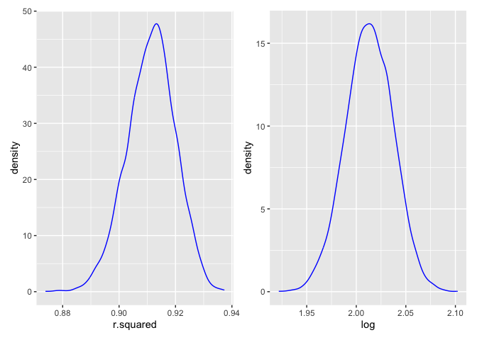
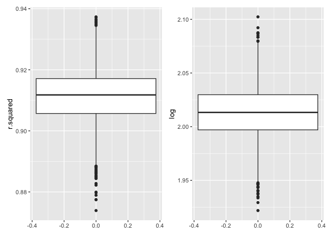

Homework 6
================
Riyadh Baksh
2024-12-02

## Problem 1

``` r
library(tidyverse)
set.seed(1)

weather_df = 
  rnoaa::meteo_pull_monitors(
    c("USW00094728"),
    var = c("PRCP", "TMIN", "TMAX"), 
    date_min = "2017-01-01",
    date_max = "2017-12-31") %>%
  mutate(
    name = recode(id, USW00094728 = "CentralPark_NY"),
    tmin = tmin / 10,
    tmax = tmax / 10) %>%
  select(name, id, everything())
```

``` r
boot_straps =
  weather_df |>
  select(tmax, tmin) |>
  modelr::bootstrap(n=5000) |>
  mutate(
    models = map(strap, \(df) lm(tmax ~ tmin, data=df)),
    results = map(models, broom::tidy),
    stats = map(models, broom::glance)
  ) |>
  select(-strap, -models)
```

``` r
r_squared =
  boot_straps |>
  unnest(stats) |>
  select(r.squared)

estimates =
  boot_straps |>
  unnest(results) |>
  select(.id, term, estimate) |>
  pivot_wider(
    names_from="term",
    values_from="estimate"
  ) |>
  rename(
    intercept = "(Intercept)"
  ) |>
  mutate(
    log = log(intercept*tmin)
  ) |>
  select(log)
```

The graphs of the distributions below show an approximately normal bell
curve distribution. It is approximately symmetric around the median. The
distributions are not perfect, but if the number of bootstrap samples
were increased, it would likely continue to better approximate a normal
distribution. The 95% confidence intervals are shown in the tables
below.

``` r
library(patchwork)

rsqr_1 =
ggplot(r_squared, aes(x=r.squared)) +
  geom_density(alpha=.4,adjust=1,color="blue")
lg_1 =
  ggplot(estimates, aes(x=log)) +
  geom_density(alpha=.4,adjust=1,color="blue")
rsqr_1 + lg_1
```

<!-- -->

``` r
rsqr_2 =
ggplot(r_squared, aes(y=r.squared)) +
  geom_boxplot()
lg_2 =
  ggplot(estimates, aes(y=log)) +
  geom_boxplot()
rsqr_2 + lg_2
```

<!-- -->

``` r
r_squared |>
  summarize(
    ci_lower = quantile(r.squared, 0.025),
    ci_upper = quantile(r.squared, 0.975)
  ) |>
  knitr::kable()
```

|  ci_lower | ci_upper |
|----------:|---------:|
| 0.8936684 | 0.927106 |

``` r
estimates |>
  summarize(
    ci_lower = quantile(log, 0.025),
    ci_upper = quantile(log, 0.975)
  ) |>
  knitr::kable()
```

| ci_lower | ci_upper |
|---------:|---------:|
| 1.964949 | 2.058887 |

## Problem 2

## Problem 3
