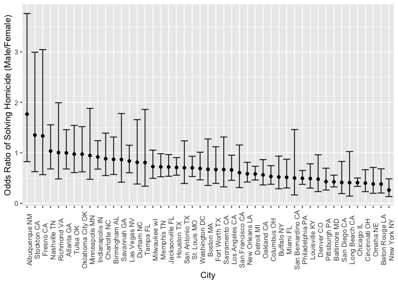

Homework 6
================
Riyadh Baksh
2024-12-02

## Problem 1

``` r
library(tidyverse)
set.seed(1)

weather_df = 
  rnoaa::meteo_pull_monitors(
    c("USW00094728"),
    var = c("PRCP", "TMIN", "TMAX"), 
    date_min = "2017-01-01",
    date_max = "2017-12-31") %>%
  mutate(
    name = recode(id, USW00094728 = "CentralPark_NY"),
    tmin = tmin / 10,
    tmax = tmax / 10) %>%
  select(name, id, everything())
```

``` r
boot_straps =
  weather_df |>
  select(tmax, tmin) |>
  modelr::bootstrap(n=5000) |>
  mutate(
    models = map(strap, \(df) lm(tmax ~ tmin, data=df)),
    results = map(models, broom::tidy),
    stats = map(models, broom::glance)
  ) |>
  select(-strap, -models)
```

``` r
r_squared =
  boot_straps |>
  unnest(stats) |>
  select(r.squared)

estimates =
  boot_straps |>
  unnest(results) |>
  select(.id, term, estimate) |>
  pivot_wider(
    names_from="term",
    values_from="estimate"
  ) |>
  rename(
    intercept = "(Intercept)"
  ) |>
  mutate(
    log = log(intercept*tmin)
  ) |>
  select(log)
```

The graphs of the distributions below show an approximately normal bell
curve distribution. It is approximately symmetric around the median. The
distributions are not perfect, but if the number of bootstrap samples
were increased, it would likely continue to better approximate a normal
distribution. The 95% confidence intervals are shown in the tables
below.

``` r
library(patchwork)

rsqr_1 =
ggplot(r_squared, aes(x=r.squared)) +
  geom_density(alpha=.4,adjust=1,color="blue")
lg_1 =
  ggplot(estimates, aes(x=log)) +
  geom_density(alpha=.4,adjust=1,color="blue")
rsqr_1 + lg_1
```

<!-- -->

``` r
rsqr_2 =
ggplot(r_squared, aes(y=r.squared)) +
  geom_boxplot()
lg_2 =
  ggplot(estimates, aes(y=log)) +
  geom_boxplot()
rsqr_2 + lg_2
```

<!-- -->

``` r
r_squared |>
  summarize(
    ci_lower = quantile(r.squared, 0.025),
    ci_upper = quantile(r.squared, 0.975)
  ) |>
  knitr::kable()
```

|  ci_lower | ci_upper |
|----------:|---------:|
| 0.8936684 | 0.927106 |

``` r
estimates |>
  summarize(
    ci_lower = quantile(log, 0.025),
    ci_upper = quantile(log, 0.975)
  ) |>
  knitr::kable()
```

| ci_lower | ci_upper |
|---------:|---------:|
| 1.964949 | 2.058887 |

## Problem 2

``` r
df =
  read_csv(file="data/homicide-data.csv") |>
  mutate(
    solved = case_match(
      disposition,
      "Open/No arrest" ~ 0,
      "Closed by arrest" ~ 1,
      "Closed without arrest" ~ 0,
    ),
    victim_age = as.numeric(victim_age),
    city_state = paste(city,state)
  ) |>
  filter(
    city_state != "Dallas TX",
    city_state != "Phoenix, AZ",
    city_state != "Kansas City MO",
    city_state != "Tulsa AL",
    victim_race == "White" | victim_race == "Black"
  ) |>
  select(city_state, victim_race, victim_age, victim_sex, solved) |>
  drop_na()
```

For the `Baltimore MD`, the odds ratio is 0.426 going from female to
male. The 95% confidence interval is (0.324, 0.558). In other words, the
odds of solving a case is 2.35 times more likely for females than for
males (the reciprocal of the odds ratio in this case).

``` r
baltimore_logistic =
  df |>
  filter(city_state == "Baltimore MD") |>
  glm(solved ~ victim_age + victim_race + victim_sex, data=_, family=binomial())

baltimore_logistic |>
  broom::tidy() |>
  mutate(OR = exp(estimate)) |>
  select(term, estimate, OR, p.value) |>
  knitr::kable(digits=3)
```

| term             | estimate |    OR | p.value |
|:-----------------|---------:|------:|--------:|
| (Intercept)      |    0.310 | 1.363 |   0.070 |
| victim_age       |   -0.007 | 0.993 |   0.043 |
| victim_raceWhite |    0.842 | 2.320 |   0.000 |
| victim_sexMale   |   -0.854 | 0.426 |   0.000 |

``` r
ci =
  baltimore_logistic |>
  confint() |>
  exp()

knitr::kable(ci, digits=3)
```

|                  | 2.5 % | 97.5 % |
|:-----------------|------:|-------:|
| (Intercept)      | 0.976 |  1.911 |
| victim_age       | 0.987 |  1.000 |
| victim_raceWhite | 1.650 |  3.276 |
| victim_sexMale   | 0.324 |  0.558 |

``` r
odds =
  df |>
  nest(data=victim_race:solved) |>
  mutate(
    models = map(data,
                 \(df) glm(solved ~ victim_race + victim_age + victim_sex,
                           data=df, family=binomial())),
    results = map(models, broom::tidy),
    ci = map(models,confint)
  ) |>
  select(-data, -models) |>
  unnest(results, ci) |>
  filter(term=="victim_sexMale") |>
  mutate(
    OR = exp(estimate),
    lower = exp(ci[,1]),
    upper = exp(ci[,2])
  ) |>
  select(city_state, OR, lower, upper) |>
  arrange(-OR)

knitr::kable(odds, digits=3)
```

| city_state        |    OR | lower | upper |
|:------------------|------:|------:|------:|
| Albuquerque NM    | 1.767 | 0.825 | 3.762 |
| Stockton CA       | 1.352 | 0.626 | 2.994 |
| Fresno CA         | 1.335 | 0.567 | 3.048 |
| Nashville TN      | 1.034 | 0.681 | 1.556 |
| Richmond VA       | 1.006 | 0.483 | 1.994 |
| Atlanta GA        | 1.000 | 0.680 | 1.458 |
| Tulsa OK          | 0.976 | 0.609 | 1.544 |
| Oklahoma City OK  | 0.974 | 0.623 | 1.520 |
| Minneapolis MN    | 0.947 | 0.476 | 1.881 |
| Indianapolis IN   | 0.919 | 0.678 | 1.241 |
| Charlotte NC      | 0.884 | 0.551 | 1.391 |
| Birmingham AL     | 0.870 | 0.571 | 1.314 |
| Savannah GA       | 0.867 | 0.419 | 1.780 |
| Las Vegas NV      | 0.837 | 0.606 | 1.151 |
| Durham NC         | 0.812 | 0.382 | 1.658 |
| Tampa FL          | 0.808 | 0.340 | 1.860 |
| Milwaukee wI      | 0.727 | 0.495 | 1.054 |
| Memphis TN        | 0.723 | 0.526 | 0.984 |
| Jacksonville FL   | 0.720 | 0.536 | 0.965 |
| Houston TX        | 0.711 | 0.557 | 0.906 |
| San Antonio TX    | 0.705 | 0.393 | 1.238 |
| St. Louis MO      | 0.703 | 0.530 | 0.932 |
| Washington DC     | 0.690 | 0.465 | 1.012 |
| Boston MA         | 0.674 | 0.353 | 1.277 |
| Fort Worth TX     | 0.669 | 0.394 | 1.121 |
| Sacramento CA     | 0.669 | 0.326 | 1.314 |
| Los Angeles CA    | 0.662 | 0.457 | 0.954 |
| San Francisco CA  | 0.608 | 0.312 | 1.155 |
| New Orleans LA    | 0.585 | 0.422 | 0.812 |
| Detroit MI        | 0.582 | 0.462 | 0.734 |
| Oakland CA        | 0.563 | 0.364 | 0.867 |
| Columbus OH       | 0.532 | 0.377 | 0.748 |
| Buffalo NY        | 0.521 | 0.288 | 0.936 |
| Miami FL          | 0.515 | 0.304 | 0.873 |
| San Bernardino CA | 0.500 | 0.166 | 1.462 |
| Philadelphia PA   | 0.496 | 0.376 | 0.650 |
| Louisville KY     | 0.491 | 0.301 | 0.784 |
| Denver CO         | 0.479 | 0.233 | 0.962 |
| Pittsburgh PA     | 0.431 | 0.263 | 0.696 |
| Baltimore MD      | 0.426 | 0.324 | 0.558 |
| San Diego CA      | 0.413 | 0.191 | 0.830 |
| Long Beach CA     | 0.410 | 0.143 | 1.024 |
| Chicago IL        | 0.410 | 0.336 | 0.501 |
| Cincinnati OH     | 0.400 | 0.231 | 0.667 |
| Omaha NE          | 0.382 | 0.199 | 0.711 |
| Baton Rouge LA    | 0.381 | 0.204 | 0.684 |
| New York NY       | 0.262 | 0.133 | 0.485 |

The plot of the odds ratio for solving a homicide if the victim is male
compared to female is shown below for each of the cities. This plot
shows that in all cities, either the odds are not significant
(confidence interval includes 1), or it is more likely that the case is
solved if the victim is female (odds ratio less than 1).

``` r
ggplot(odds,aes(x=reorder(city_state,-OR),y=OR)) +
  geom_point() +
  geom_errorbar(aes(ymin=lower,ymax=upper)) +
  theme(axis.text.x=element_text(angle=90)) +
  xlab("City") +
  ylab("Odds Ratio of Solving Homicide (Male/Female)")
```

<!-- -->

## Problem 3
